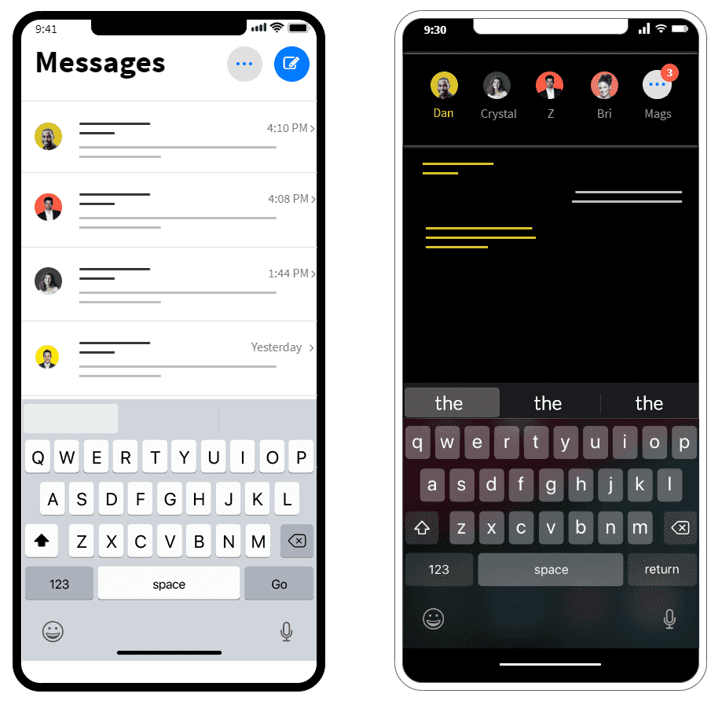

#  Busy Bees
First Ionic app attempt-- creating a messenger app and to-do list

## Purpose
Just creating a personal chat app for myself and a few friends. It will keep track of project related chat and tasks.

## Tech
Frontend
> Ionic Framework with React/Typescript for frontend UX and UI interaction. 

Backend
> Firebase with Chat SDK

https://ionicframework.com/  
https://chatsdk.co/  
https://github.com/chat-sdk/chat-sdk-web  
https://firebase.google.com/  

## How to Use (for myself, not any possible users)

- Go to your new project: `cd .\busy-bees`
- Run `ionic serve` within the app directory to see your app in the browser
  > **Note:** The CLI claims that the project is running on
    `http://10.0.0.12/`, which is not true. Open `http://localhost:8100/` to open the application.

- Run `ionic capacitor` add to add a native iOS or Android project using Capacitor        
- Generate your app icon and splash screens using `cordova-res --skip-config --copy`      
- Explore the Ionic docs for components, tutorials, and more: https://ion.link/docs     
- Building an enterprise app? Ionic has Enterprise Support and Features:
https://ion.link/enterprise-edition

- Deploying Firebase Hosting
  > Navigate to the root directory of the app. 
- Sign in to Google
- `firebase login`
- Initiate your project
- `firebase init`
- When you're ready, deploy your web app
- `firebase deploy`

After deploying, view your app at https://busy-bees-1cd1c.web.app

### Basic Mockup of a General messenger App-- comparing normal (light) to prototype (dark) messenger app.

## Notes

* `.tsx` is TypeScript; `tsx` allows the usage of `jsx` tags. If you don't use any jsx tags in a `.tsx`, then just leave it to be normal `.ts`. 